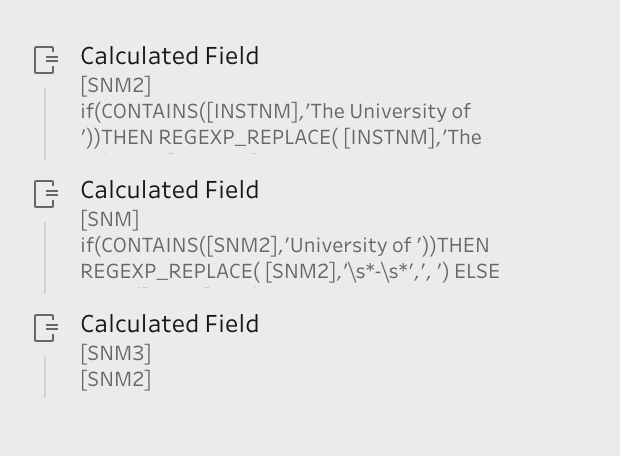

# Landing at San Francisco International Airport Explored and Other abitrary things: The Data Pipeline


## 1. Setting up R


### R Libraries


```{r setup, include=TRUE}
knitr::opts_chunk$set(echo = TRUE)
## Includes stringr, forcats, tibble, purrr, readr, tidyr, dplyr and ggpplot2
library(tidyverse)
## Used to improve texts: https://www.r-project.org/nosvn/pandoc/crayon.html
library(crayon)
## Used for improved piping: https://cran.r-project.org/web/packages/magrittr/vignettes/magrittr.html
library(magrittr)
## Used for Making date modification easier: https://lubridate.tidyverse.org/
library(lubridate)
## Used in tidying data and manipulating tables: https://cran.r-project.org/web/packages/broom/vignettes/broom.html
library(broom)
## Stringr is for string manip and string functions: https://www.rdocumentation.org/packages/stringr/versions/1.4.0
library(stringr)
## Not needed but useful for map visualizations: https://rstudio.github.io/leaflet/
library(leaflet)
```

## 2. Ingesting, Cleaning and/or Building A Dataset

#### Structured Ingestion: An Aside

There are many tools that enable you to take the tables you have and build a table that is more effective in containing relevant information of your data. For example, below I used Tableau Prep Builder to create a table that combined College Rankings and a Federal data set on US colleges. All things done in Tableau can be done here in R using the appropriate libraries, but because Tableau provides a better visualization of the manipulation steps I use this to create the conceptual methodology if one was to build a data set as an example.

First, I need to state the tables I will be combining and why. Let's say I have 4 tables, cwurData.csv:a table of top 1000 World ranked colleges, hd2017.csv, ic2017.csv, ic2017_ay.csv: 3 tables that are all from the same sourcs, and already have entity resolution on a University ID variable called UNITID, so the biggest issue is that cwurData.csv Does not have this Resolution with the other datasets.

### Tidying Data & Entity Resolution

These two different sources of data do have a similarity and that is that the hd2017.csv and cwurData.csv both contain a String variable that contains the name of the universities. And holy schemoly is it messy. If you were to try to have entity resolution between these two lists, you would only get about 160 matches between the two tables. We need to up our game so let's try to see why some school names for the same school are different between the two data sets. What ends up being the case is that the college names for state schools mostly in the cwur data do not contain as long as a name, nor specify which branch of the state school system it has a rank for, we will get back to this as this may end up being a hard problem made easier. Another issue is that there are sometime The's and different and's or at's in the names. So here is where we clean up the data, this is done with regular expressions, or "Regex". To learn more on Regular Expressions go here:

https://www.computerhope.com/jargon/r/regex.htm

In short we are going to create a new column in each table that ignores any The's, commas, at's, and's, of's and other small english modifiers to try and create a unique identifier that has better resolution of values:



Also to remove the clutter in the cwur dataset which contains international data points we want to remove all the non-US Schools and focus on just american universities:


Tidying narrows the cwur down to 573 schools. The new column also sports 48 more matches than before bringing the total 1:1 resolutions to 208 leaving the remaining schools to be 365 in the cwur that need matching and in Tableau that is easy, and so too in R by following the steps of going by hand and searching for the school in the larger data file of hd2017. And this is where we see the expensive portion of data analysis is in the cleaning of data:

https://www.forbes.com/sites/gilpress/2016/03/23/data-preparation-most-time-consuming-least-enjoyable-data-science-task-survey-says/#32efb3c56f63


 

Then you can group and replace the remaining values by hand

 

Joining all the tables together after joining two of the separate sources of data:


### *NOTE*: For the rest of the project, I will be using a premade data set sourced from:

https://www.kaggle.com/san-francisco/sf-air-traffic-passenger-and-landings-statistics/downloads/sf-air-traffic-passenger-and-landings-statistics.zip/68

### Loading the Tables

To read in a file that is a .csv you can use the readr library function read_csv. This works with a url to a .csv file as well as a local file.

```{r loadingData1}
landing<-read_csv("./data/air-traffic-landings-statistics.csv")%>%
  as.data.frame()
passengers<-read_csv("./data/air-traffic-passenger-statistics.csv")%>%
  as.data.frame()
```


#### Showing a short preview of the Data

Instead of making the program print the max amount of rows of a table, or eve the whole thing, you can use head to show the first limited number of rows. This is helpful in being quicker and cleaner than the whole table.

```{r previewingData1}
head(passengers)
```

```{r previewingData2}
head(landing)
```

#### Renaming Entries In the Table

So in looking at our tables(We will focus on just landing for this project) I notice that there are column names with spaces. Now you can use `` to surround these names, but some times R just does not like invalid names, so we have to get rid of these spaces using a Regex just like we used a regex to modify the table, only this time I am modifying the table names. I use "." just because when I am typing these names, it is faster for me to use the . than a _ or - or somthing else like camel case.

```{r tidying}
names(passengers)<-str_replace_all(names(passengers), c(" " = "." , "," = "" ))
```

If you notice the c() modifier. This is just combining the attributes inside into a vector to use when applying the Regex.

```{r tidying2}
names(landing)<-str_replace_all(names(landing), c(" " = "." , "," = "" ))
head(landing)
```

## 3. Exploring the Data

### Setting up new data columns
Ok so here is the fun part. If I ever need to create a new column to save myself time from recalculating every time I need to access a certain variable I set up a section in R that I use to efficiently run at the begining so all the columns I could ever want are already made. That Or I create a small new table of the Entities that I would like. 

Also take note of the %>% modifier. This is a shortcut to pass data argument into a function and passing that functions return to the next int the flow of functions so that 

returnval<-function(arg1 DATA, arg2 .....) 
endgoal<-function2(arg1 returnval, arg2....)

can be written as 
endgoal<- DATA%>%function(arg2 .....) %>% function2(arg2,....)

```{r addingcol}
landing$Avg.Weight<-landing$Total.Landed.Weight/landing$Landing.Count

landing$activity.date=as.Date(paste0(as.character(landing$Activity.Period), '01'), format='%Y%m%d')

landing$activity.year=format(as.Date(landing$activity.date, format="%d/%m/%Y"),"%Y")

landing$Aircraft=paste(landing$Aircraft.Manufacturer,landing$Aircraft.Model, sep =" ")

landing$GM=paste(landing$Aircraft.Manufacturer,landing$GEO.Summary, sep =" ")

landing=landing%>%filter(activity.year>2004)

head(landing)
```

### Vizualizing Data Types

### Using ggplot2: The Basics

Plotting points using ggplot2 is easy. Using the Pipe to flow the data and the + modifier specified for the ggplot() function, we create an "aesthetic" mapping with aes(x,y,...). This allows us to also change the mapping for future plot types and also different data sets can be used in the same plot. 

We can see in this code snippet below:

```{r ggBasics}
#plotting a scatter based on the average weight per body type

landing%>%
  ggplot(aes(x=Aircraft.Body.Type,y=Avg.Weight))+
  geom_point()
```

So there is a visual difference in height. Let's clean this up with the r factor order functions: fct_reorder and fct_inorder. Because the data is categorical and not continuous we can do so using these functions.

Let's order these categorical data points:

```{r ggBasics2}
#plotting a scatter based on the average weight per body type

landing%>%
  ggplot(aes(x=fct_reorder(Aircraft.Body.Type,Avg.Weight),group=GEO.Summary,y=Avg.Weight))+
  geom_point()
```


Drawing boxplots with ggplot2 is simple. One can just set up the aes like a scatter and then call geom_boxplot.

```{r ggBasics3}
#plotting a scatter based on the average weight per body type

landing%>%
  ggplot(aes(x=fct_reorder(Aircraft.Body.Type,Avg.Weight),y=Avg.Weight))+
  geom_boxplot()
```

This is cool but lets say we want to encode a 3 axis in this data set. We have already used the 2D position and 3D visualizations are not the best so the another channel we can use is colour. ggplot2 has a great colouring system already in place to automatically define the scale for either categorical variables or even continuous. If those don suit your fancy you can create your own scale:
cof <- colorFactor(c(list of colors), domain=c(the categories of the domain))

however we do not worry about that here:

```{r ggBasics4}
#plotting a box based on the average weight per body type and then separating the boxes by color over Domestic Vs International.

landing%>%
  ggplot(aes(x=fct_reorder(Aircraft.Body.Type,Avg.Weight),y=Avg.Weight,colour=GEO.Summary))+
  geom_boxplot()
```

we can do the same over the year. Some times you may need to factor an x variable to create buckets so that multiple boxplots show up one for each "bucket" using the factor(variable to be factored) functions.

```{r ggBasics5}
#plotting a box based on the average weight per body type
landing%>%
  ggplot(aes(x=activity.year,y=Avg.Weight,colour=GEO.Summary))+
  geom_boxplot()
```

### Using ggplot2: More Advanced

changing the dot size for more legibility and adding a fade, and remember when adding different plots to a graph you should add them in the order of the layers they should appear of the map, where the last one is the layer on top and the first is on the bottom:

```{r Advanced}
#plotting a scatter based on the average weight per body type
landing%>%
  ggplot(aes(x=activity.year,colour=factor(Landing.Aircraft.Type),y=Avg.Weight))+
  geom_point(size=.03,alpha=1/3)
```

### Filtering and Adding "Jitter"

Filtering allows for further analyzing a dataset by allowing one to single out specific relationships. This is done with the Filter functions.

```{r ggBasics2a}
#plotting a scatter based on the average weight per body type
landing_select <- landing %>% 
   filter(Aircraft.Manufacturer == "Boeing" | Aircraft.Manufacturer == "Airbus")
landing_select%>%
  ggplot(aes(x=fct_reorder(Aircraft.Body.Type,Avg.Weight),y=Avg.Weight,colour=Aircraft.Manufacturer))+
  geom_point()
```

Adding a Jitter is easy and there are many different specifications for a jitter. Jitters are for specifically trying to show areas of more events or dots so that instead of a straight line of points on the map you have points distributed randomly over a short range of width to unhide the density and in a way adds volume to your mapping.

```{r Advanced5}
#plotting a jitter based on the average weight per body type
landing%>%
  ggplot(aes(x=activity.year,colour=factor(Landing.Aircraft.Type),y=Avg.Weight))+
  geom_boxplot()+
  geom_jitter(size=.01)
```

## 4. Analyzing Your Data Exploration

Something you may want to look at is the story you are building up to.

#### "Are Planes Landing heavier on average?"

### Regressions

```{r Regression2}
#plotting a scatter based on the average weight per body type
landing%>%
  ggplot(aes(x=activity.date,colour=factor(Landing.Aircraft.Type),y=Avg.Weight))+
  geom_smooth(method = "lm")+
  geom_point(size=.01)
```

Well maybe they are, so let draw some lines to find out. Using ggplot2 we can call geom_smooth() to aid in our line drawing skills. Infact it takes over for us. I colour based on whether the plane was domestic or international.

```{r ggBasics7}
#plotting a scatter based on the average weight per body type


landing%>%
  ggplot(aes(x=as.Date(activity.year,format="%Y"),y=Avg.Weight,colour=GEO.Summary))+
  geom_point()+
  geom_smooth()
```

To force the type of regression out of the Default Loess Regression, one may specify any of the multiple options. Here I use "lm". I also make the line a thicker line for visibility purposes and I again add an alpha to try and declutter the numerous points and sort of create a density.

```{r Regression1}
#plotting a scatter based on the average weight per body type
landing%>%
  filter(Aircraft.Manufacturer == "Boeing" | Aircraft.Manufacturer == "Airbus")%>%
  filter(activity.year>2004)%>%
  ggplot(aes(x=activity.date,colour=factor(Aircraft.Manufacturer),y=Avg.Weight))+
  geom_point(size=.01,alpha=1/2)+
  geom_smooth(method = "lm",size=2)
```

#### Boeing vs Airbus yearly


Here I am adding another regression but now only over Airbus and Boeing and splitting the two companies back into domestic and International landings.

```{r regression3}
#plotting a scatter based on the average weight per body type

landing%>%
  filter(Aircraft.Manufacturer == "Boeing" | Aircraft.Manufacturer == "Airbus")%>%
  ggplot(aes(x=as.Date(activity.year,format="%Y"),y=Avg.Weight,colour=GM))+
  geom_point()+
  geom_smooth(method="lm")
```

Plotting a Residual Plot

You want to make sure that your X is numeric, note the year change between fit2 and fit3. Year is a numeric. These equations fit a linear regression to the data plot. To analyze the fit of the plot one can examine the coefficients printed by r:

```{r Regreassing7a}
gap_fit2 <- lm(activity.year~Avg.Weight*GEO.Summary*Aircraft.Manufacturer, data=landing_select)
gap_fit2
gap_fit3 <- lm(activity.year~Avg.Weight, data=landing_select)
gap_fit3
```

To compare the two linear regressions you may use anova:

```{r anova}
anova(gap_fit2,gap_fit3)
```

And to utilize these linear regressions with ggplot, you can use .fitted for a fitted x or any other relative x variable, (I chose year as numeric), and to access such data like residuals of the linear regression is simple, just use ".resid".

```{r Regreassing7b}
ggplot(gap_fit3) + 
  geom_point(aes(x=activity.year, y=.resid))
```

And again.

```{r Regreassing7c}
ggplot(gap_fit2) + 
  geom_point(aes(x=activity.year, y=.resid))
```